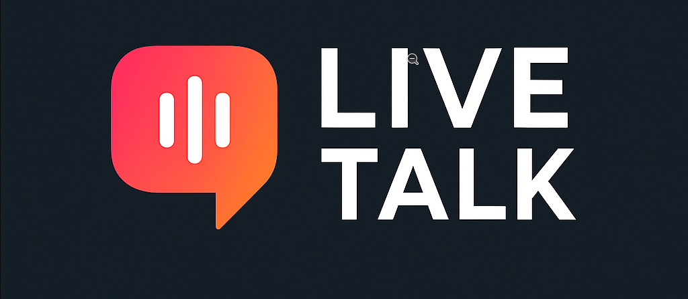

# LiveTalk



## 🔹 Descrição do Projeto

Este é um **chat em tempo real** construído com **Node.js, Express e Socket.IO**, pensado para ser simples, funcional e moderno.

O objetivo do projeto é **proporcionar uma experiência de chat fluida**, onde os usuários podem se conectar, enviar mensagens instantâneas e acompanhar em tempo real a entrada e saída de participantes.

O projeto serve como estudo prático de **Socket.IO** e comunicação **cliente-servidor em tempo real**, além de reforçar conceitos de **Clean Code**, separação de responsabilidades no frontend e backend, e boas práticas de desenvolvimento.

---

## 🔹 Funcionalidades

- Login rápido apenas com nome de usuário
- Lista de usuários conectados atualizada em tempo real
- Envio de mensagens instantâneas
- Mensagens de status ao entrar ou sair do chat
- Reconexão automática em caso de queda de conexão

---

## 🔹 Prints do Projeto

### Tela de Login

 <!-- Substitua pelo print do login -->

### Tela do Chat

 <!-- Substitua pelo print do chat em branco ou vazio -->

### Mensagens em tempo real

 <!-- Substitua pelo print do chat com mensagens -->

---

## 🔹 Tecnologias Utilizadas

- **Node.js** - para o servidor
- **Express** - para servir arquivos estáticos e rotas
- **Socket.IO** - para comunicação em tempo real
- **HTML, CSS e JavaScript** - frontend
- **Nodemon** - hot reload no desenvolvimento

---

## 🔹 Aprendizados

Durante o desenvolvimento deste projeto, foi possível aprender e reforçar:

- Como **Socket.IO** permite comunicação bidirecional entre servidor e cliente em tempo real
- Como **emitir e ouvir eventos personalizados** (`joined`, `user-connected`, `user-disconnected`, `message`, `update-user-list`)
- Como **manter a lista de usuários sincronizada** entre vários clientes
- Separação de responsabilidades no frontend, criando **funções pequenas e significativas**
- Boas práticas de **Clean Code**: nomes claros, funções pequenas, eventos bem organizados

---

## 🔹 Como Rodar o Projeto

### Pré-requisitos

- Node.js >= 18
- NPM ou Yarn

### Passos

1. Clonar o repositório

```bash
git clone https://github.com/leeocoder/chat-socket-node.git
cd chat-socket-node
```

2. Instalar dependências

```bash
npm install
# ou
yarn
```

3. Rodar em modo desenvolvimento

```bash
npm run dev
# ou
yarn dev
```

4. Acessar no navegador

```
http://localhost:3000
```

---

## 🔹 Estrutura do Projeto

```
chat-socket-node/
├── src/
│   └── server.js       # Servidor Node.js com Socket.IO
├── public/
│   ├── index.html      # Frontend do chat
│   ├── main.js         # Lógica do chat, socket e UI
│   └── style.css       # Estilos do chat
├── package.json
└── README.md
```

---

## 🔹 Próximos Passos / Evoluções

- Criar salas privadas
- Adicionar emojis e formatação de mensagens
- Sistema de notificações para usuários offline
- Armazenar histórico de mensagens em banco de dados

---

## 🔹 Conclusão

Este projeto não é apenas um chat funcional — ele é **uma demonstração prática de como aplicações em tempo real funcionam com Node.js e Socket.IO**, além de mostrar a importância de **código limpo, organizado e de fácil manutenção**.

Cada detalhe do frontend e backend foi pensado para que **qualquer desenvolvedor júnior consiga entender a lógica** sem esforço, e que ao mesmo tempo **refletisse boas práticas de um desenvolvedor sênior**.

Socket.IO trouxe uma experiência muito rica, mostrando o poder dos **eventos customizados e comunicação em tempo real**, e como pequenas decisões no backend impactam diretamente na UX do usuário.

---

## 🔹 Autor

Leonardo Albuquerque

[GitHub](https://github.com/leeocoder)
